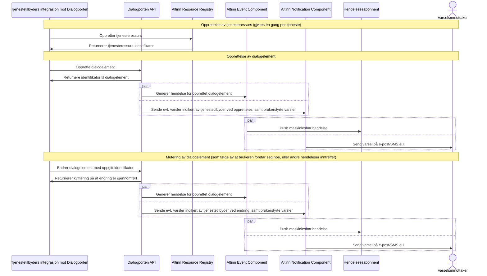
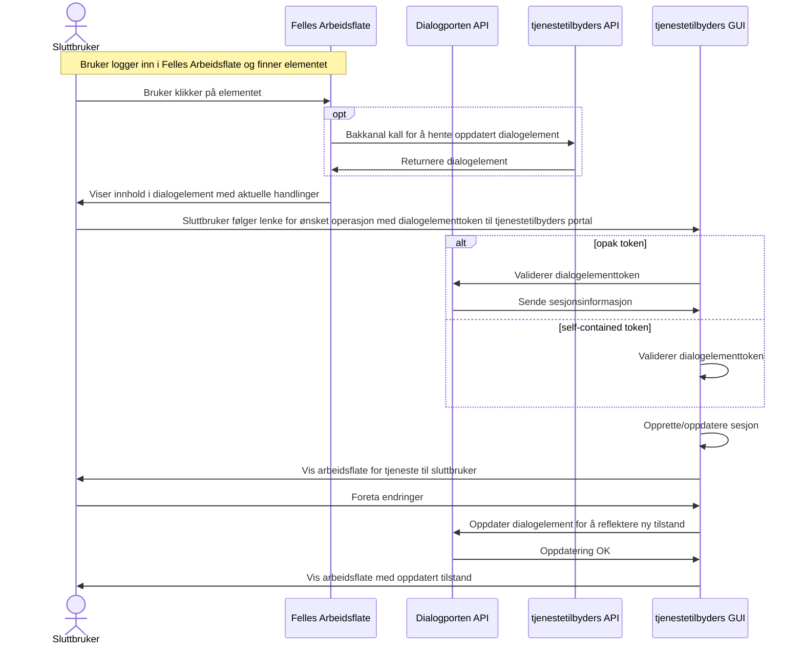
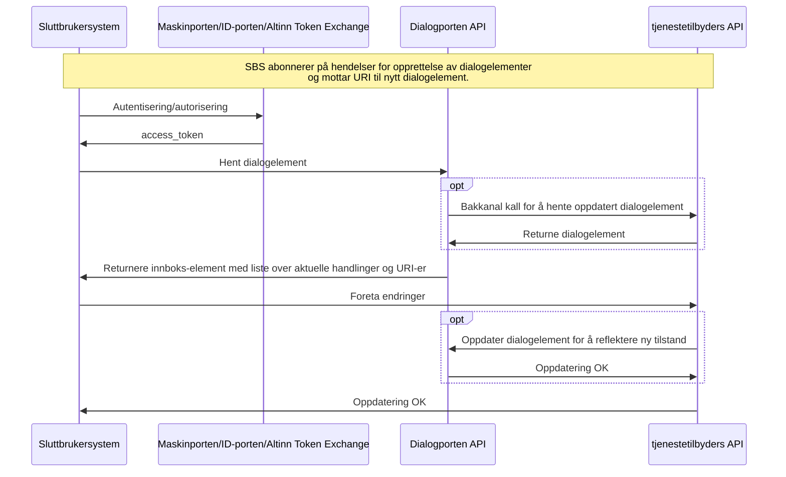
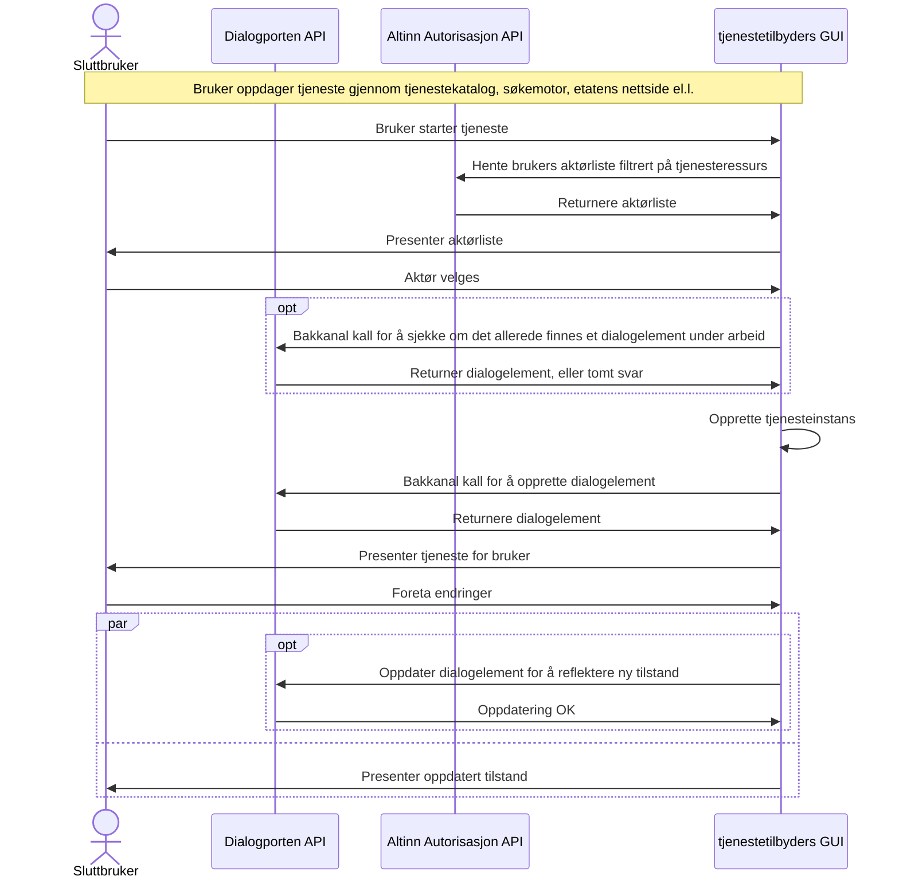
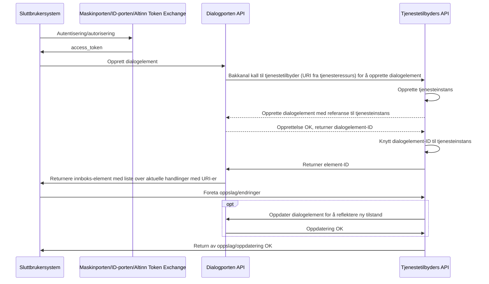
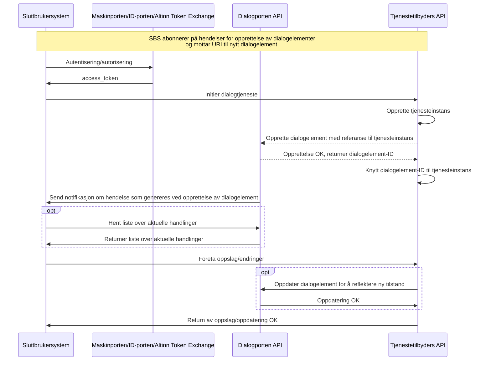

Versjon 0.3 - Bjørn Dybvik Langfors, sist endret: {{ page.last_modified_at  | date: '%d. %b %Y, kl. %H:%M:%S' }} [(se git-historikk)](https://github.com/elsand/elsand.github.io/commits/master/dialogporten.md)

# Introduksjon



I dette notatet beskrives et konsept for hvordan tjenester, som i denne konteksten er begrenset til dialogtjenester, kan nyttiggjøre seg av fellesfunksjonalitet i økosystemet av Altinn-produkter, herunder dagens "innboks", sluttbrukers arkiv, autorisasjon, varsling og hendelser uten at det innebærer behov for å benytte seg av Altinns utviklingsmiljøer eller applikasjonskjøretidsmiljø. Alle interaksjoner mellom tjenestetilbydere og denne løsningen foregår via API-er, og det legges opp til stor fleksibilitet i hvorvidt løsningen involveres og det legges ingen begrensninger på hvordan forretningslogikken eller ulike brukerflater hos tjenestetilbyder realiseres.

# Viktige begreper

## GUI 

_"Graphical User Interface"_, som på norsk kan oversettes til grafisk brukergrensesnitt. Typisk en webløsning som konsumeres gjennom en nettleser, men kan også være f.eks. et fagsystem i form av en desktop-applikasjon eller en mobil app.

## API 

_"Application Programming Interface"_, maskinelt grensesnitt som gjør det mulig for ulike systemer å kommunisere på hverandre.

## Dialogporten

_Dialogporten_ benyttes for å betegne det overordnede konseptet som beskrives i dette dokumentet, samt prosjektet/tiltaket som i første omgang søker å undersøke hvorvidt dette kan realiseres.

Dialogporten benyttes også som navn på løsningskomponenten (produktet) som tilbyr API for enhetlig tilgang og håndtering av digitale dialoger til Felles Arbeidsflate(r) og Sluttbrukersystemer, inkludert lagring av metadata om dialogene, og som dekker Altinn Platform-funksjonalitet for tilgangsstyring og -kontroll, hendelser og varsling.

## Felles Arbeidsflate 

_Felles Arbeidsflate_ refererer til en tenkt implementasjon av et GUI som benytter seg av Dialogporten, og som fungerer som en felles grafisk arbeidsflate for alle som ikke benytter et sluttbrukersystem eller et skreddersydd GUI implementert på f.eks. en etatsportal.

## Sluttbrukersystem (SBS) og fagsystem

_Sluttbrukersystemer_ og _fagsystemer_ er begge applikasjoner som benytter seg API for å tilby et skreddersydd GUI for en eller flere grupper brukere i ulike kontekster. 

## Tjenestetilbyder

En _tjenestetilbyder_ er en etat eller offentlig virksomhet som har behov for å føre dialog med publikum i forbindelse med forvaltning av et eller flere lovverk. I noen tilfeller er det private aktører som tilbyr tjenesten på vegne av en offentlig virksomhet.

## Part

En _part_ er en person, enten fysisk eller juridisk, som tjenestetilbyderen har dialog med.

## Dialogtjeneste

En _dialogtjeneste_ er en digital tjeneste tjenestetilbyderen kommuniserer med en part i forbindelse med forvaltning av et eller flere lovverk. Tradisjonelt innebærer en dialogtjeneste bruk av ulike skjema, hvor parten - gjennom et GUI levert av tjenestetilbyderen og/eller et API levert av tjenestetilbyderen og tatt i bruk av et sluttbrukersystem eller fagsystem.

Som det pekes på i avsnittet [Scenarioer som påvirker Dialogporten](#scenarioer-som-påvirker-dialogporten) vil en dialogtjeneste i denne konteksten også kunne dekke behovet tjenestetilbydere har for å kunne dele informasjon, altså det som typisk kalles "digital post".

## Tjenesteinstans

_Tjenesteinstans_, eller bare instans, refererer seg til en konkret dialog mellom en tjenestetilbyder og en eller flere parter, og som typisk refererer en saksgang eller prosess hos tjenestetilbyderen, og/eller realiserer et behov parten har for innsyn i opplysninger hos tjenestetilbyder. Typisk representerer en instans "livsløpet" til en konkret dialog, og er tilstandsfull - altså den består gjerne av flere ulike trinn som typisk gjøres sekvensielt (men som i noen tilfeller kan ha parallelle "spor" som involverer flere parter) hvor dialogen har ulike tilstander og kan manipuleres på ulike måter. All håndtering og forretningslogikk/semantikk knyttet til en tjenesteinstans håndteres av tjenestetilbyderen.

## Dialogelement (DE)

Tilstand i Dialogporten begrenser seg til metadata for en gitt tjenesteinstans, og manifesterer seg i Dialogporten i form av et _dialogelement_, som er en logisk entitet tilgjengelig gjennom API og gjort synlig i GUI som f.eks. Felles Arbeidsflate, tilsvarende det en ser i dagens "Innboks" i Altinn.

Dialogelementet reflekterer tilstanden til en eller annen pågående eller avsluttet dialog  fra en tjenestetilbyder, og inneholder beskrivende metadata, f.eks. hvem som er mottakende part, adresse (URL), overskrift, dato, status samt en liste over aktuelle _handlinger_ som kan utføres på dialogelementet. Dialogporten knytter semantikk kun til enkelte typer handlinger (slett), hvis dette gjøres tilgjengelig av tjenestetilbyder. Andre handlinger kan vilkårlig defineres av tjenestetilbyder, og all interaksjon med selve tjenesteinstansen foregår i tjenestetilbyders brukerflater (GUI og/eller API).

En viktig forskjell mot dagens «correspondence» i Altinn, er at dialogelementene er _mutérbare_. Et dialogelement kan (men må ikke) konfigureres til å foreta et synkront kall til et endepunkt hos tjenestetilbyder idet brukeren åpner/aksesserer elementet for å vise en dynamisk oppdatert «preview» (etter tjenestetilbyders forgodtbefinnende) av innholdet i elementet, sammen med en oppdatert liste over aktuelle handlinger.

Tjenestetilbyder kan også når som helst oppdatere metadata og tilgjengelige handlinger på elementet. Enhver endringe fører til at det genereres _hendelser_, som autoriserte parter kan agere på, f.eks. at det sendes et varsel eller at et SBS foretar seg noe.

## Dialoggruppe (DG)

Enkelte typer saksganger består av flere distinkte delprosesser/dialoger som ikke enkelt eller hensiktsmessig kan knyttes til ett og samme dialogelement, f.eks. når det er ulike dialoger som må gjennomføres med ulike parter og som ikke nødvendigvis skal foregå sekvensielt.

Alle dialogelementer kan referere en dialoggruppe (DG), som knytter disse sammen. En dialoggruppe er ikke en egen entitet, men er en rik attributt på dialogelementet som lar GUI-implementasjoner gruppere/sammenknytte dialogelementer som logisk hører sammen.

## Hendelser

_Hendelser_ refererer til tekniske applikasjonshendelser som genereres av Dialogporten (eller tjenestetilbyder) og publiseres gjennom [Event-komponenten i Altinn](https://docs.altinn.studio/technology/solutions/altinn-platform/events/). Hendelser kan konsumeres av autoriserte parter og tjenestetilbyder, i tråd med de autorisasjonsregler tjenestetilbyder har definert.

## Handlinger

En _handling_ (som i «action») beskriver en interaksjon som brukere kan gjøre med eller relatert til en tjenesteinstans. Eksempler på handlinger er «Åpne», «Arkiver», «Slett», «Start signering», «Betal», «Bekreft», «Les mer» etc. Listen over aktuelle handlinger er en del av den strukturerte beskrivelsen av en dialogelementet, og kan når som helst endres av tjenestetilbyder gjennom API.

En handling er enten en _«GUI»-handling_ eller en _«API»-handling_.

### GUI-handlinger

GUI-handlinger gjøres synlige for brukeren i form av knapper, lenker eller lignende. Tjenestetilbyderen oppgir selv om en gitt handling er å regne som en primær-, sekundær eller tertiær-handling, noe som påvirker hvordan dette presenteres til brukeren. En primærhandling vil typisk presenteres som en fremhevet knapp («call to action»), og benyttes for det som er det logiske neste steget. En sekundærhandling (f.eks. «Avbryt») kan være en mer nedtonet knapp, eller tekstlenker, mens en tertiærhandling (f.eks. «Les mer om denne tjenesten») kan gjemmes bak en nedtrekksmeny eller lignende. Alt dette vil være opp til det aktuelle GUI-et som benyttes å vurdere, og ulike vurderinger vil kunne gjøres avhengig av "view" - altså kontekst, tenkt brukergruppe m.m.

Alle GUI-handlinger har en URL. Disse URLene blir kalt i det brukeren aktiverer den aktuelle handlingen. Typisk innebærer dette at brukeren blir omdirigert til etatens egen brukerflate hvor den aktuelle handlingen da utføres, enten automatisk eller gjennom videre brukerinteraksjon. Andre handlinger kan markeres at de skal utføres gjennom bakkanal-kall. Brukeren blir da ikke omdirigert, men Dialogporten vil da foreta en forespørsel på vegne av brukeren til den oppgitte URL-en. Tjenestetilbyderen returnerer da det oppdaterte elementet, som umiddelbart blir vist brukeren igjen. Ved feil (enten av tekniske eller forretningslogiske årsaker) kan en feilmelding vises.

Det er kun én GUI-handling som Dialogporten knytter semantikk til; slett. Denne fungerer som andre handlinger, men vil alltid innebære et bakkanal-kall, som hvis vellykket, fører til at dialogelementet blir markert som slettet i Dialogporten, og da typisk flyttes til en "papirkurv" eller lignende. Felles Arbeidsflate vil også kunne knytte ekstra UI-logikk til disse handlingene (f.eks. vise en «Er du sikker?» dialog i forkant).

### API-handling

En API-handling er tiltenkt SBS-er og portaler som benytter Dialogporten gjennom en egen integrasjon. Disse inneholder også en identifikator som indikerer hva slags type handling det er snakk om, hvilken URL som må kalles for å utføre handlingen, hvilken HTTP-operasjon som skal benyttes (typisk GET eller POST), og en lenke til en strukturert beskrivelse (JSON Schema) av datamodellen som enten returneres eller forventes som input.



Alle handlinger - både GUI og API - har en identifikator som mappes til en _action_ (og valgfritt en _subressurs_) i _autorisasjonspolicyen_ som er knyttet til en _tjenesteressurs._

## Tjenesteressurs

Alle dialogelementer må referere en _tjenesteressurs_. En tjenesteressurs utgjør autorisasjonsbæreren, og kan sammenlignes med moderne bruk av lenketjenester i Altinn 2. Dette er en beskrivelse av en tjeneste som ligger i [Altinn Resource Registry](https://docs.altinn.studio/technology/solutions/altinn-platform/authorization/resourceregistry/), en ny komponent i Altinn Autorisasjon. Hver tjenesteressurs har en autorisasjonspolicy uttrykt i [XACML](https://docs.altinn.studio/technology/solutions/altinn-platform/authorization/xacml/), som beskriver hvilke tilgangsregler som gjelder for alle dialogelementer som refererer den. XACML gir stor fleksibilitet i hvor grov- eller finkornet tilgangskontrollen skal være, og Dialogporten vil legge denne policyen til grunn for å bestemme hvem som kan se ett gitt dialogelement, og hvilke handlinger som skal være tilgjengelige. 

Eksempelvis vil GUI-handlingen «Signer» referere en _action_ kalt «sign» i XACML-policyen, som krever tilganger den innloggende brukeren ikke besitter. Knappen vil derfor være grået ut og deaktivert. Tjenesteressursen er det tilgangsstyrere i virksomhetene forholder seg til, mht hvem som skal ha tilgang til å gjøre hva på vegne av en virksomhet (tilsvarende dagens tjenestedelegering).

Handlinger og andre deler (typisk referanser til vedlegg) av i dialogelementet kan også referere en _subressurs_, som kan ha andre autorisasjonsregler knyttet til seg. Dette muliggjør at man kan ha ulike autorisasjonskrav for samme type handling som er tilgjengelige ved ulike tilstander tjenesteinstansen har. F.eks. vil det kunne brukes for å la et signeringssteg kun være tilgjengelig for en ekstern revisor/regnskapsfører.

På samme måte vil API-handlinger som ikke er tilgjengelige for SBS-et (med den identiteten SBS-et oppgir) ikke returneres. 

Opplysninger om hvem som er den autoriserte parten overføres gjennom et _dialogelementtoken._

## Dialogelementtoken (DET)

Et dialogelementtoken er et signert JSON Web Token (JWT) som inneholder informasjon om den autentiserte brukeren/organisasjonen, hvilken aktør som er valgt, identifikator til dialogelementet, dato og andre opplysninger. Les mer i avsnittet  [Autorisasjon](#autorisasjon).

# Scenarioer som påvirker Dialogporten

Det er typisk tre scenarioer som innebærer behov for interaksjon med Dialogporten og dialogelementer.

1. **Sluttbruker-initiert dialog**, hvor sluttbruker (på vegne av seg selv eller annen part) finner og starter tjeneste ved hjelp av  
    * Offentlig tjenestekatalog
    * Søkemotor
    * Etatenes nettsider
    * SBS (enten manuelt eller fordi SBS agerer på en hendelse  
    Dette fører til at tjenestetilbyder oppretter et dialogelement i Dialogporten som tilhører den aktuelle mottakeren.  

2. **Tjenestetilbyder-initiert dialog**, hvor tjenestetilbyder oppretter dialogelementet selv i Dialogporten som tilhører den aktuelle mottakeren. Dette er typisk:
    * «Prefill»-scenarioer, hvor tjenestetilbyderen trenger å innhente opplysninger og gir aktøren et delvis forhåndsutfylt skjema å begynne med
    * Proaktive/sammenhengende tjenester, hvor en tjenestetilbyder igangsetter en dialog som følge av en hendelse (som kan ha oppstått i en annen tjeneste)  

3. **Sending av digital post**
    * DPV, DPI
    * Typisk én-veis (foruten «rekommandert»-funksjonalitet hvor tjenestetilbyder trenger bekreftelse på at melding er mottatt og lest)
    * Ikke-muterbar - meldingen forandrer seg ikke etter at den er mottatt (annet enn «lest»-status og arkiv/slettet-tilstand)
    * Kan være utgangspunkt for sluttbruker-initiert dialog, med lenker til «neste trinn»
    * Teknisk/funksjonelt subset av tjenestetilbyder-initiert dialog.

Det finnes andre scenarioer rundt oppslag/innsynstjenester og filoverføringer som trolig ikke vil behøve en representasjon i en Dialogporten, og er følgelig out-of-scope for dette arbeidet.

# Overordnet diagram over konsept


# Autorisasjon

Det legges opp til at hvert element blir utstyrt med et eget token (dialogelementtoken) som Felles Arbeidsflate og SBS-er benytter i alle URL-er mot tjenestetilbyder. Dette gjør det mulig å overføre sesjoner og autorisasjonsdata utover det som finnes i ID-porten/Maskinportet-tokens mellom Dialogporten og den aktuelle tjenestetilbyderen. Ved bruk av omdirigeringer i GUI-handlinger vil tjenestetilbyderen også kunne lene seg på SSO fra ID-porten for å autentisere brukeren, og validere at informasjonen i dialogelementtokenet stemmer overens.

Dialogelementtokenet benyttes som et "bearer token", altså noe som indikerer at ihendehaveren er autorisert av Dialogporten til en liste med påstander (claims) som ligger i tokenet. [Standard JWT-claims](https://www.rfc-editor.org/rfc/rfc7519#section-4.1) og [JWS-parametere](https://www.rfc-editor.org/rfc/rfc7515#section-4.1) som definert i RFC7519 og RFC7515 vil inkluderes, i tillegg til de Dialogporten-spesifikke påstandene under:

## Dialogporten-spesifikke claims

| Claim            | Beskrivelse                                                                                                                                                        | Eksempel                                                                           |
|------------------|------------------------------------------------------------------------------------------------------------------------------------------------------------------- |----------------------------------------------------------------------------------- |
| c                | Autentisert som konsument av Dialogporten. Prefikset for  hhv. personer (typisk ID-porten), organisasjoner (typisk Maskinporten) eller selvregistrerte brukere.    | `"person:12018212345"`, `"org:991825827"` eller `"username:someemail@example.com"` |
| l                | Sikkerhetsnivå på autentisering (4)                                                                                                                                | `4`                                                                                |
| s                | Valgfritt. Hvis det er benyttet et leverandørtoken i Maskinporten, vil autentisert leverandørs organisasjonsnummer oppgis her. Prefiks er alltid `org:`.           | `"org:991825827"`                                                                  |
| p                | Hvem konsument opptrer på vegne av (om ikke seg selv), altså hvem som eier det aktuelle dialogelementet.                                                           | `"person:12018212345"`, `"org:991825827"` eller `"username:someemail@example.com"` |
| i                | Unik identifikator til dialogelement.                                                                                                                              | `"e0300961-85fb-4ef2-abff-681d77f9960e"`                                           |
| e                | Ekstern referanse til elementet                                                                                                                                    | `"123456789"`                                                                      |
| a                | Liste over autoriserte actions. Kan være prefixet med `<ressurs>:` hvis actionen omfatter en navngitt ressurs i XACML policy som ikke er tjenesteressursen         | `[ "open", "attachment1:open", "confirm" ]`                                        |

## Eksempel på dekodet token

```jsonc
{
  "alg": "EdDSA",
  "typ": "JWT",
  "kid" : "dp-2023-01" 
}
// .
{
  "l": 4,
  "p": "org:991825827",
  "i": "e0300961-85fb-4ef2-abff-681d77f9960e",
  "e": "123456789",
  "a": [
    "open",
    "attachment1:open",
    "confirm"
  ],
  "exp": 1672772834, // Tokenet er her gyldig i 15 minutter og caches deretter
  "iss": "https://dialogporten.no",
  "nbf": 1672771934,
  "iat": 1672771934 
}
 
// .
// <signatur>
```

Tokenet kan verifiseres på vanlig vis gjennom at det publiseres et nøkkelsett (JWK) på et kjent endepunkt. Med å hente den offentlige nøkkelen definert av `kid` kan tjenestetilbyder verifisere at tokenet er gyldig. 

## Overføring av token til tjenestetilbyder

Tokenet vil inkluderes i responsmodellen som returneres til SBS-er og Felles arbeidsflate i feltet `dialogElementToken`. For GUI-handlinger, eller andre dyplenker til tjenesteinstans hos tjenestetilbyder hvor bruker omdirigeres i nettleser, vil Felles arbeidsflate legge til tokenet som et fast query-parameter konfigurerte URL-en. F.eks. hvis en GUI-handling er definert til å være på `https://example.com/some/deep/link/to/dialogues/123456789` vil Felles arbeidsflate omdirigere brukeren til `https://example.com/some/deep/link/to/dialogues/123456789?dialogElementToken={token}` hvor `{token}` er en Base64URL enkodet JWT.

For URL-er som aksesseres via bakkanal eller andre mekanismer kan alternativt token overføres gjennom HTTP headeren `X-DialogElementToken`. Tjenestetilbydere må håndtere begge mekanismene.


# Sekvensbeskrivelser

Under følger punktvis beskrivelser av fire ulike sekvenser. Det er to måter en dialog kan initieres på; enten av sluttbruker eller tjenestetilbyder. Hver av disse kan gjennomføres ved hjelp av GUI eller API.

## Tjenestetilbyder-initiert dialog

### Opprettelse av dialogelement 

#### Sekvensdiagram



#### Tekstlig beskrivelse av trinn

1.  Tjenestetilbyder oppretter tjenesteressurs i Altinn Resource Registry som refererer den aktuelle tjenesten
2.  Tjenestetilbyder oppretter dialogelement som    
    * Referer tjenesteressurs
    * Inneholder tekstlig metadata (tittel, ingress etc) i flere språk
    * Inneholder andre (valgfrie) metadata som f.eks.
    * Frist
    * "Fra"-felt
    * Dato for når elementet skal aktiveres
    * Tjenestetilbyder sin egen referanse/ID
    * Eventuell tilhørlighet til dialogelement-gruppe
    * Inneholder (valgfri) URI for å hente oppdatering strukturert versjon av dialogelementet, hvis hensiktsmessig for tjenesten. Brukes typisk i det brukeren ekspanderer dialogelementet for å vise
        * Dynamisk rikt innhold hentet i sanntid
        * Hvilke handlinger som kan utføres på elementet (se under)
        * Hvis ikke oppgitt, vises de metadata/handlinger jf. siste oppdatering som ble gjort av tjenestetilbyder (hvis noen, etter opprettelse)
    * Beskriver tilgjengelige handlinger (for både API og GUI)
        * Strukturert liste over handlinger som kan gjøres på elementet, typisk "Åpne", "Arkiver", "Slett", "Bekreft", "Signer", "Betal", "Les mer", etc. 
        * GUI-handlinger kan flagges som primær, sekundær og tertiær-handlinger som påvirker hvordan dette vises til bruker (f.eks. kan primær og sekundærhandlinger vises som ulike typer knapper, mens tertiærhandlinger vises i en nedtrekksliste/tekstlenker).
        * Er gjenstand for autorisasjon definert av referert tjenesteressurs og eventuell subressurs. F.eks. vil f.eks. "Signer" kunne kreve andre rettigheter avhengig av policy knyttet til tjenesteressursen.
        * Hver GUI-handling inneholder
            * En identifikator for handlingen. "Standard"-handlinger vil kunne oppgis som allerede finnes oversatt i Dialogporten.
            * Hvis ikke standard-handling, tekst som beskriver handlingen i flere språk
            * En valgfri hjelpetekst som kan fremvises brukeren som gir mer informasjon om hva handlingen innebærer
            * Flagg som indikerer om handlingen skal utføres i bakkanal
            * En URI som enten (1) brukeren vil omdirigert til når hen aktiverer det aktuelle GUI-elementet (f.eks. en knapp) eller (2) Felles Arbeidsflate vil kalle hvis på vegne av brukeren hvis flagget som bakkanal-kall
            * Hvis bakkanal-kall, skal URI-en skal returnerer en standardmodell som indikerer om kallet var vellykket, eller om det skal vises en feilmelding.
            * Flagg som indikerer om elementet skal slettes/arkiveres i Dialogporten hvis kall til URI lykkes (vil brukes til f.eks. "Er du sikker"-prompts)
        * Hver API-handling inneholder
            * En identifikator for handlingen
            * Hvilken http-metode som skal benyttes
            * En URI som handlingen skal utføres mot
            * JSON Schema el.l. som beskriver datamodellen som skal pushes/pulles
    * Inneholder informasjon om varsling på SMS/e-post/push etc
    * Inneholder valgfri liste over filvedlegg, som består av
        * En tittel på flere språk
        * En MIME-filtype som brukes for å indikere til brukeren type vedlegg (PDF etc)
        * En URI som dyplenker til vedlegget
        * Størrelse på vedlegget i bytes
    * Kan muteres etter opprettelse
        * Tilgjengelige handlinger kan oppdateres når som helst av tjenestetilbyder (som alternativ/supplement til at kall gjøres når bruker laster elementet)
        * Tittel og annen tekstlig metadata
        * Status ("under utfylling", "klar til signering", "venter på andre", "venter på svar fra tjenestetilbyder" etc) 
    * Etter vellykket opprettelse, returner en unik identifikator for dialogelementet.  
3.  Når elementet er opprettet/endret vil det
    *  Genereres hendelser som vil kunne konsumeres av parten
    * Disse kan igjen være koblet til brukerstyrt varsling på e-post/SMS andre push-kanaler 

### Konsum gjennom GUI (portal)

#### Sekvensdiagram



#### Tekstlig beskrivelse av trinn

1.  Bruker mottar varsling på en eller annen kanal, og logger inn i Felles Arbeidsflate
2.  Elementet har en grafisk fremstilling som viser overskrift, status og andre metadata
3.  Bruker klikker på elementet for å ekspandere det. Hvis det av tjenestetilbyder ble oppgitt en URI for å oppdatere elementet, vil Dialogporten kalle denne i en bakkanal og vise innholdet dynamisk samt oppdatere evt endrede metadata. Ekspandert element viser rikt innhold som tjenestetilbyder har definert, sammen med tilgjengelige handlinger. Hvis oppdatering feilet, vises enten feilmelding som tjenestetilbyder oppga, eller en standardfeilmelding.
4.  Bruker klikker på den definerte primærhandlingen.
    * Felles Arbeidsflate vil da redirecte brukeren (nettleseren) til oppgitt URI. Det legges på et dialogelementtoken som parameter i URI-en.
    * Når tjenestetilbyder mottar forspørsel fra nettleser, gjøres et bakkanal-oppslag mot Dialogporten tjenestetilbyder-API hvor dialogelementtoken oppgis. Returnerer en modell som forteller
        *  autentisert part (f/dnr, orgnr)
        *  valgt aktør
        *  tidspunkt
        *  identifikator for elementet som ble klikket
        *  tjenestetilbyders referanse til elementet
        *  identifikator for valgt handling
    * Alternativ til opak streng kan det brukes et token i form av en JWT som inneholder den samme informasjonen signert av Digdir. Dette unngår bruken av bakkanal, og reduserer behovet for tilstandshåndtering.  
5.  Ved hjelp av tokenet og SSO i ID-porten blir brukeren umiddelbart logget inn hos tjenestetilbyder og tatt inn til tjenesteinstansen, hvor brukeren interagerer med tjenesten. Etter hvert som dialogen skrider frem, kan tjenestetilbyder gjøre bakkanal-kall til Dialogporten for å oppdatere dialogelementet slik det fremstår for brukeren.
6.  Hvis brukeren fullfører dialogen, kan tjenestetilbyder gjøre et bakkanal-kall for å indikere til Dialogporten at dialogelementet skal arkiveres. Elementet blir da flyttet til sluttbrukers arkiv. Merk at det fremdeles kun ligger da (ikke lenger muterbare) metadata på elementet i Dialogporten.
7.  Når brukeren senere ekspanderer elementet i en arkiv-visning i Felles Arbeidsflate, gjøres det samme kallet for å hente siste oppdaterte (altså arkiverte) element fra tjenestetilbyder. Typisk vises da bare en kort tekst og et vedlegg til en PDF-versjon av en kvittering/gjenpart el.l.

### Konsum gjennom API

#### Sekvensdiagram



#### Tekstlig beskrivelse av trinn

1.  SBS abonnerer på hendelser knyttet til opprettelse av dialogelementer av en eller flere typer, og mottar en notifikasjon om at et nytt dialogelement er opprettet. Notifikasjonen inneholder en URI til dialogelementet i Dialogportens API. Alternativt kan liste med dialogelementer hentes gjennom standard Dialogporten-API-er
2.  Avhengig av autorisasjonspolicy tilhørende tjenesteressursen, autoriserer SBS-et seg. Dette kan være gjennom brukerstyrt datadeling i ID-porten (OAuth2/OIDC) eller ved hjelp av Maskinporten (ren OAuth2). Tokenet kan også inneholde scopes som kreves av tjenestetilbyderen, og tokenet bør da utstedes med både Dialogporten og tjenestetilbyder som i "aud"-claim. Hvis Maskinporten-token, kan policyen ha rettighetskrav som krever at det i tillegg autentiseres en virksomhetsbruker (systemidentitet i Altinn med tildelte rettigheter som gir tilgang til tjenesteressursen), som innbærer en tokenutveksling og utstedelse av et beriket Maskinporten-token. Dette resulterer i ett (eller to, hvis også beriket Altinn-token) access token som brukes i alle påfølgende kall.
3.  Ved uthenting av elementet som ble referert av hendelsen, returneres en strukturert modell som langt på vei speiler modellen som tjenestetilbyder opprinnelig sendte inn. Listen over handlinger definerer da hva SBS-et kan foreta seg, og hvilke endepunkter som må aksesseres for å utføre handlingene.  Enkelte handlinger kan være synlige/gyldige kun for portal, eller kun for API.  Handlinger kun synlige for API kan også referere JSON schemas el.l. som beskriver datamodellen som forventes på det aktuelle endepunktet. Tilsvarende håndtering av  GUI-handlinger legges det ved et dialogelementtoken som inneholder informasjon om tidspunkt, autentisert part, valgt avgiver, aktuelt element, valgt handling.
4.  SBS-et interagerer med tjenestetilbyders API gjennom endepunktene som elementet beskriver, og/eller i tråd med swagger/annen dokumentasjon som tjenestetilbyder har tilgjengeliggjort f.eks. via API-katalogen. Access token som utstedt av Altinn og/eller Maskinporten benyttes. Etter hvert som dialogen skrider frem, kan tjenestetilbyder gjøre bakkanal-kall til Dialogporten for å oppdatere dialogelementet slik det fremstår for brukeren både i portal og API.

## Sluttbruker-initiert dialog

### Gjennom GUI (portal) 

#### Sekvensdiagram



#### Tekstlig beskrivelse av trinn

1.  Bruker oppdager tjeneste gjennom tjenestekatalog, søkemotor, etatenes nettsider el.l.
2.  Bruker starter tjenesten og blir umiddelbart tatt inn i brukerflaten hos tjenestetilbyderen, og velger aktør avhengig av tjenestens natur (via autorisasjonskall mot Altinn Autorisasjon for å bygge aktørliste)
3.  Tjenestetilbyder gjør bakkanal-kall for å opprette dialogelement i Dialogporten
    * Her kan en se på muligheten for å la tjenestetilbyder sjekke om det allerede finnes instanser av tjenesten hos samme aktør som inneholder en eller annen status ("under arbeid" eller lignende) og gi bruker mulighet til å fortsette å jobbe med den instansen, eller opprette en ny.
4.  Sluttbruker interagerer med tjenesten, og tjenestetilbyder gjør kall til Dialogporten for å oppdatere dialogelementet.
5.  Hvis bruker avslutter økten før dialogen er ferdigstilt, kan han/hun (eller andre autoriserte) fortsette å jobbe med dialogen gjennom å aksessere dialogelementet i Felles Arbeidsflate. Prosessen blir da som "tjenestetilbyder-initiert dialog / Konsum gjennom GUI (portal)" steg 2. 
  
### Gjennom API

*  Her er det to nærliggende alternativer - skal tjenester kunne "instansieres"
    a) gjennom et felles "instansierings"-API i Dialogporten som gjør bakkanal-kall til tjenestetilbyder og returnerer et dialogelement med liste over handlinger/endepunkter?
    b)  direkte mot tjenestetilbyders API-er som da kan gjøre bakkanal-kall til Dialogporten for å oppgi dialogelementet?

*  Begge deler bør kanskje kunne støttes? Førstnevnte gir en mer homogen løsning sett fra SBS-ene sin side; selv om all kommunikasjon går direkte mot tjenestetilbyder etter instansiering, er dialogelementet et som vil kunne reflektere gjeldende tilstand/status og aktuelle handlinger. Det andre løsningen gir en løsere kobling til Dialogporten, men gjør at SBS-et i mindre grad kan forholde seg til en felles brukerflate.
*  Under skisseres en løsning med felles instansierings-API

#### Variant med instansierings-API 



1.  ("Design-time") SBS oppdager API gjennom API-katalog eller annen dokumentasjon, og foretar merkantil og teknisk onboarding (setter opp Maskinporten-klient med rette scopes, oppretter virksomhetsbruker etc)
2.  SBS autoriserer seg (tilsvarende "tjenestetilbyder-initiert dialog / Konsum gjennom API", trinn 2.
3.  SBS gjør et kall til et standard API i Dialogporten ("createinstance" el.l) som oppgir aktør og tjenesteressurs
4.  Dialogporten foretar autorisasjon basert på policy knyttet til tjenesteressurs, og hvis godkjent gjør et bakkanal kall til et instansierings-endepunkt som er definert på tjenesteressurs. Kallet inneholder en standard modell som beskriver autentisert part, valgt aktør, og tjenesteressurs.
5.  Tjenestetilbyder oppretter instans (el.l) i egne systemer, og gjør bakkanal-kall tilbake til Dialogporten for å opprette dialogelement som beskrevet i "tjenestetilbyder-initert dialog", trinn 2.
6.  Tjenestetilbyder mottar fra Dialogporten identifikator til dialogelement, som da kan knyttes til egen tjenesteinstans
7.  Tjenestetilbyder returnerer identifikator til dialogelement til Dialogporten
8.  Dialogporten laster det nyopprettede dialogelementet, og returner dette til SBS
9.  SBS interagerer med tjenestetilbyders API-er som beskrevet i "tjenestetilbyder-initiert dialog / Konsum gjennom API", trinn 4

#### Variant uten instansierings-API 



1.  SBS abonnerer på hendelser knyttet til opprettelse av dialogelementer av en eller flere typer
2.  SBS autoriserer seg med de mekanismer som kreves av tjenesten
3.  SBS gjør et eller annet kall for å initiere (og potensielt samtidig fullføre) en dialogtjeneste hos tjenestetilbyder
4.  Tjenestetilbyder oppretter instans (el.l) i egne systemer, og gjør bakkanal-kall tilbake til Dialogporten for å opprette dialogelement som beskrevet i "tjenestetilbyder-initert dialog", trinn 2.
5.  Tjenestetilbyder mottar fra Dialogporten identifikator til dialogelement, som da kan knyttes til egen tjenesteinstans
6. Gjennom abonnementet på hendelser knyttet til opprettelse av dialogelementer mottar SBS-et en notifikasjon om at dialogelementet for dialogtjenesten nå finnes
7.  Hvis aktuelt, kan SBS-et hente ned dialogelementet for å få se en liste over autoriserte handlinger som kan foretas. Dette forutsetter at SBS-et har autorisert seg mot Dialoboksen i trinn 2.
8.  SBS interagerer med tjenestetilbyders API-er som beskrevet i "tjenestetilbyder-initiert dialog / Konsum gjennom API", trinn 4
9. Tjenestetilbyder oppdaterer dialogelementet for å reflektere tilstanden på dialogen

# OpenAPI

En foreløpig OpenAPI 3.0.1 specification (OAS) basert på modellene beskrevet under kan sees på [https://app.swaggerhub.com/apis-docs/Altinn/Dialogporten](https://app.swaggerhub.com/apis-docs/Altinn/Dialogporten). 

# Eksempel-modeller

Under er utkast til JSON-modeller slik de kan fremstå i API-ene som må implementeres gitt beskrivelsene over, med kommentarer.


  
  
  <h2 id="{{ jsonPageId }}">{{ jsonPageName }}</h2>
  {{ dpj.content | markdownify }}


