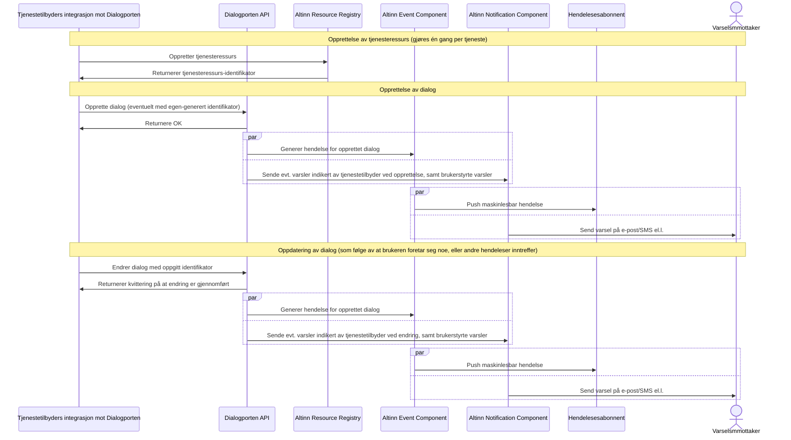
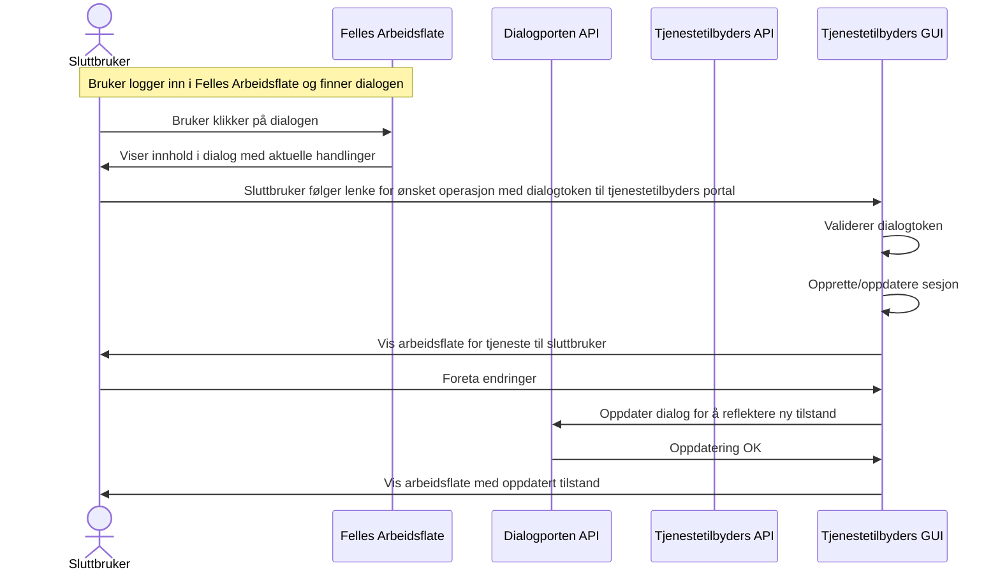
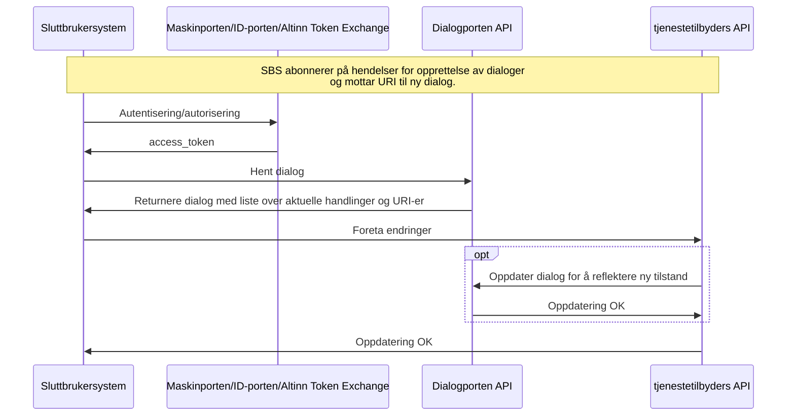
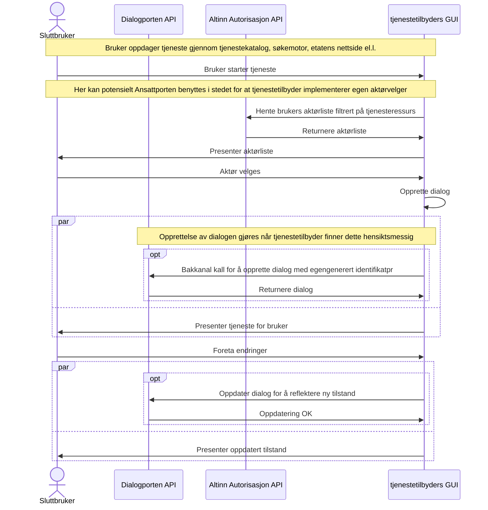
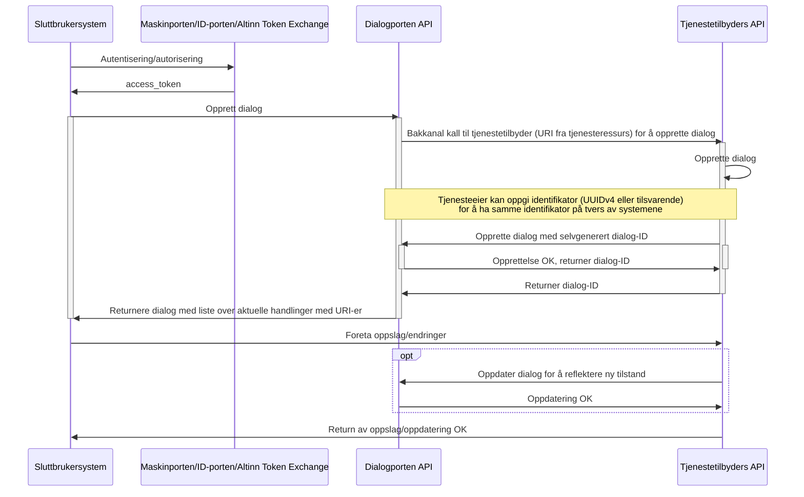
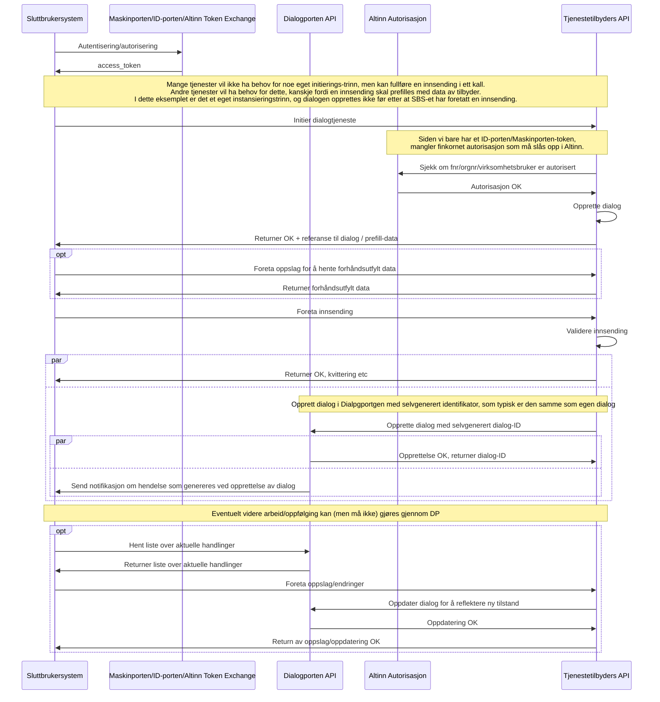
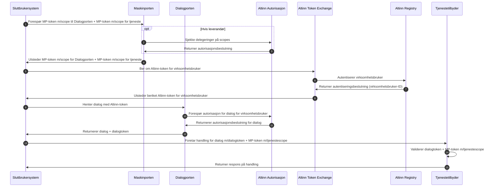
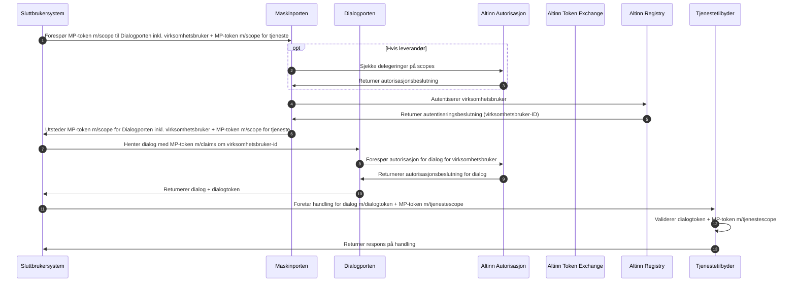
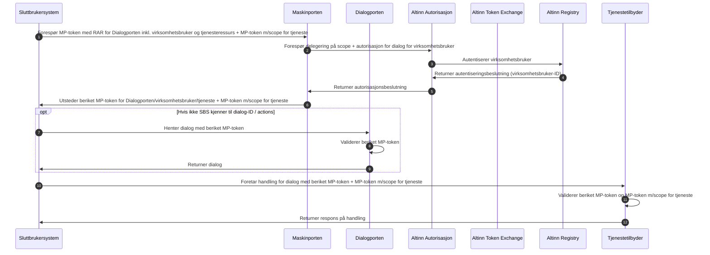
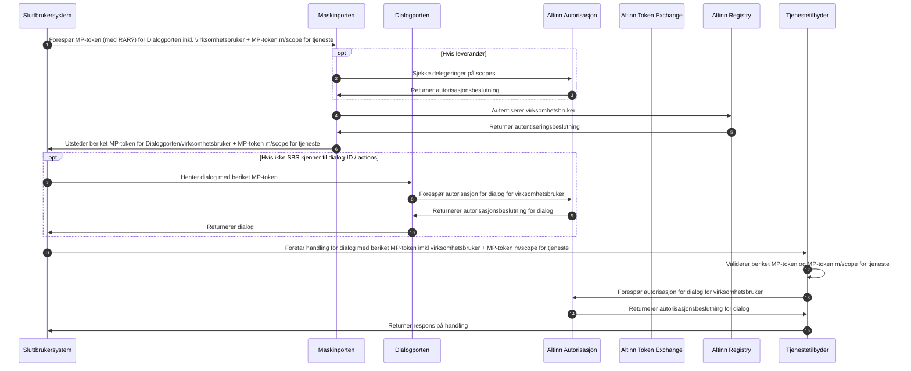

Versjon 0.3 - Bjørn Dybvik Langfors, sist endret: {{ page.last_modified_at  | date: '%d. %b %Y, kl. %H:%M:%S' }} [(se git-historikk)](https://github.com/elsand/elsand.github.io/commits/master/dialogporten.md)

# Introduksjon



I dette notatet beskrives et konsept for hvordan tjenester, som i denne konteksten er begrenset til dialogtjenester, kan nyttiggjøre seg av fellesfunksjonalitet i økosystemet av Altinn-produkter, herunder dagens "innboks", sluttbrukers arkiv, autorisasjon, varsling og hendelser uten at det innebærer behov for å benytte seg av Altinns utviklingsmiljøer eller applikasjonskjøretidsmiljø. Alle interaksjoner mellom tjenestetilbydere og denne løsningen foregår via API-er, og det legges opp til stor fleksibilitet i hvorvidt løsningen involveres og det legges ingen begrensninger på hvordan forretningslogikken eller ulike brukerflater hos tjenestetilbyder realiseres.

# Viktige begreper

## GUI 

_"Graphical User Interface"_, som på norsk kan oversettes til grafisk brukergrensesnitt. Typisk en webløsning som konsumeres gjennom en nettleser, men kan også være f.eks. et fagsystem i form av en desktop-applikasjon eller en mobil app.

## API 

_"Application Programming Interface"_, maskinelt grensesnitt som gjør det mulig for ulike systemer å kommunisere på hverandre.

## Dialogporten

_Dialogporten_ benyttes for å betegne det overordnede konseptet som beskrives i dette dokumentet, samt prosjektet/tiltaket som i første omgang søker å undersøke hvorvidt dette kan realiseres.

Dialogporten benyttes også som navn på løsningskomponenten (produktet) som tilbyr API for enhetlig tilgang og håndtering av digitale dialoger til Felles Arbeidsflate(r) og Sluttbrukersystemer, inkludert lagring av metadata om dialogene, og som dekker Altinn Platform-funksjonalitet for tilgangsstyring og -kontroll, hendelser og varsling.

## Felles Arbeidsflate 

_Felles Arbeidsflate_ refererer til en tenkt implementasjon av et GUI som benytter seg av Dialogporten, og som fungerer som en felles grafisk arbeidsflate for alle som ikke benytter et sluttbrukersystem eller et skreddersydd GUI implementert på f.eks. en etatsportal.

## Sluttbrukersystem (SBS) og fagsystem

_Sluttbrukersystemer_ og _fagsystemer_ er begge applikasjoner som benytter seg API for å tilby et skreddersydd GUI for en eller flere grupper brukere i ulike kontekster. 

## Tjenestetilbyder

En _tjenestetilbyder_ er en etat eller offentlig virksomhet som har behov for å føre dialog med publikum i forbindelse med forvaltning av et eller flere lovverk. I noen tilfeller er det private aktører som tilbyr tjenesten på vegne av en offentlig virksomhet.

## Part

En _part_ er en person, enten fysisk eller juridisk, som tjenestetilbyderen har dialog med.

## Dialogtjeneste

En _dialogtjeneste_ er en digital tjeneste, typisk på web, hvor tjenestetilbyderen kommuniserer med en part i forbindelse med forvaltning av et eller flere lovverk. Tradisjonelt innebærer en dialogtjeneste bruk av ulike skjema, hvor parten - gjennom et GUI levert av tjenestetilbyderen og/eller et API levert av tjenestetilbyderen og tatt i bruk av et sluttbrukersystem eller fagsystem. En dialogtjeneste har gjerne definert flere ulike trinn som typisk gjøres sekvensielt (men som i noen tilfeller kan ha parallelle "spor" som involverer flere parter).

Som det pekes på i avsnittet [Scenarioer som påvirker Dialogporten](#scenarioer-som-påvirker-dialogporten) vil en dialogtjeneste i denne konteksten også kunne dekke behovet tjenestetilbydere har for å kunne dele informasjon, altså det som typisk kalles "digital post".

## Dialog

Tilstand i Dialogporten begrenser seg til metadata for en gitt dialog hos tjenestetilbyder, og manifesterer seg i Dialogporten i form av en _dialog_, som er en logisk entitet tilgjengelig gjennom API og gjort synlig i GUI som f.eks. Felles Arbeidsflate, tilsvarende det en ser i dagens "Innboks" i Altinn. Dialogen 

Dialogen fungerer som en abstrakt og felles modell for alle pågående eller avsluttede [spesialiserte dialoger](#spesialisert-dialog) hos en tjenestetilbyder, og inneholder beskrivende metadata, f.eks. hvem som er mottakende part, adresse (URL), overskrift, dato, status samt en liste over aktuelle _handlinger_ som kan utføres av brukeren. Dialogporten knytter semantikk kun til slette-handlinger, hvis dette gjøres tilgjengelig av tjenestetilbyder. Andre handlinger kan vilkårlig defineres av tjenestetilbyder, og all interaksjon med den dialogen foregår i tjenestetilbyders brukerflater (unntaket er GUI-handlinger som går gjennom bakkanal, se mer om dette i avsnittet [Hendelser](#hendelser)).

En viktig forskjell mot dagens «correspondence» i Altinn, er at dialogene i Dialogporten er _mutérbare_. Tjenestetilbyder kan når som helst oppdatere metadata og tilgjengelige handlinger på dialogen. Enhver endring fører til at det genereres _hendelser_, som autoriserte parter kan agere på, f.eks. at det sendes et varsel eller at et SBS foretar seg noe.

Dialoger har en UUID som identifikator. Tjenesteeier kan selv oppgi ønsket UUID ved opprettelse for å gjøre det mulig å bruke samme identifikator på tvers av systemer.

## Spesialisert dialog

Med _spesialisert dialog_, refereres det til en konkret dialog (f.eks. innsending av Skattemelding)mellom en tjenestetilbyder og en eller flere parter, og som typisk refererer en saksgang eller prosess hos tjenestetilbyderen, og/eller realiserer et behov parten har for innsyn i opplysninger hos tjenestetilbyder. En spesialisert dialog kan ses på som en tilstandsfull "instans" av en dialogtjeneste. All håndtering og forretningslogikk/semantikk knyttet til en spesialisert dialog håndteres av tjenestetilbyderen.

## Dialoggruppe (DG)

Enkelte typer saksganger består av flere distinkte delprosesser/dialoger som ikke enkelt eller hensiktsmessig kan knyttes til en og samme dialog, f.eks. når det er ulike dialoger som må gjennomføres med ulike parter og som ikke nødvendigvis skal foregå sekvensielt.

Alle dialoger kan referere en dialoggruppe (DG), som knytter disse sammen. En dialoggruppe er ikke en egen entitet, men er en rik attributt på dialogen som lar GUI-implementasjoner gruppere/sammenknytte dialoger som logisk hører sammen.

## Hendelser

_Hendelser_ refererer til tekniske applikasjonshendelser som genereres av Dialogporten (eller tjenestetilbyder) og publiseres gjennom [Event-komponenten i Altinn](https://docs.altinn.studio/technology/solutions/altinn-platform/events/). Hendelser kan konsumeres av autoriserte parter og tjenestetilbyder, i tråd med de autorisasjonsregler tjenestetilbyder har definert.

## Handlinger

En _handling_ (som i «action») beskriver en interaksjon som brukere kan gjøre med eller relatert til en dialog. Eksempler på handlinger er «Åpne», «Arkiver», «Slett», «Start signering», «Betal», «Bekreft», «Les mer» etc. Listen over aktuelle handlinger er en del av den strukturerte beskrivelsen av en dialogen, og kan når som helst endres av tjenestetilbyder gjennom API.

En handling er enten en _«GUI»-handling_ eller en _«API»-handling_.

### GUI-handlinger

GUI-handlinger gjøres synlige for brukeren i form av knapper, lenker eller lignende. Tjenestetilbyderen oppgir selv om en gitt handling er å regne som en primær-, sekundær eller tertiær-handling, noe som påvirker hvordan dette presenteres til brukeren. En primærhandling vil typisk presenteres som en fremhevet knapp («call to action»), og benyttes for det som er det logiske neste steget. En sekundærhandling (f.eks. «Avbryt») kan være en mer nedtonet knapp, eller tekstlenker, mens en tertiærhandling (f.eks. «Les mer om denne tjenesten») kan gjemmes bak en nedtrekksmeny eller lignende. Alt dette vil være opp til det aktuelle GUI-et som benyttes å vurdere, og ulike vurderinger vil kunne gjøres avhengig av "view" - altså kontekst, tenkt brukergruppe m.m.

Alle GUI-handlinger har en URL. Disse URLene blir kalt i det brukeren aktiverer den aktuelle handlingen. Typisk innebærer dette at brukeren blir omdirigert til etatens egen brukerflate hvor den aktuelle handlingen da utføres, enten automatisk eller gjennom videre brukerinteraksjon. Andre handlinger kan markeres at de skal utføres gjennom bakkanal-kall. Brukeren blir da ikke omdirigert, men Dialogporten vil da foreta en forespørsel på vegne av brukeren til den oppgitte URL-en. Tjenestetilbyderen returnerer da den oppdaterte dialogen, som umiddelbart blir vist brukeren igjen. Ved feil (enten av tekniske eller forretningslogiske årsaker) kan en feilmelding vises.

Det er kun én GUI-handling som Dialogporten knytter semantikk til; slett. Denne fungerer som andre handlinger, men vil alltid innebære et bakkanal-kall, som hvis vellykket, fører til at dialogen blir markert som slettet i Dialogporten, og da typisk flyttes til en "papirkurv" eller lignende. Felles Arbeidsflate vil også kunne knytte ekstra UI-logikk til disse handlingene (f.eks. vise en «Er du sikker?» dialog i forkant).

### API-handling

En API-handling er tiltenkt SBS-er og portaler som benytter Dialogporten gjennom en egen integrasjon. Disse inneholder også en identifikator som indikerer hva slags type handling det er snakk om, hvilken URL som må kalles for å utføre handlingen, hvilken HTTP-operasjon som skal benyttes (typisk GET eller POST), og en lenke til en strukturert beskrivelse (JSON Schema) av datamodellen som enten returneres eller forventes som input.



Alle handlinger - både GUI og API - har en identifikator som mappes til en _action_ (og valgfritt en _subressurs_) i _autorisasjonspolicyen_ som er knyttet til en _tjenesteressurs._

## Tjenesteressurs

Alle dialoger må referere en _tjenesteressurs_. En tjenesteressurs utgjør autorisasjonsbæreren, og kan sammenlignes med moderne bruk av lenketjenester i Altinn 2. Dette er en beskrivelse av en tjeneste som ligger i [Altinn Resource Registry](https://docs.altinn.studio/technology/solutions/altinn-platform/authorization/resourceregistry/), en ny komponent i Altinn Autorisasjon. Hver tjenesteressurs har en autorisasjonspolicy uttrykt i [XACML](https://docs.altinn.studio/technology/solutions/altinn-platform/authorization/xacml/), som beskriver hvilke tilgangsregler som gjelder for alle dialoger som refererer den. XACML gir stor fleksibilitet i hvor grov- eller finkornet tilgangskontrollen skal være, og Dialogporten vil legge denne policyen til grunn for å bestemme hvem som kan se en gitt dialog, og hvilke handlinger som skal være tilgjengelige. 

Eksempelvis vil GUI-handlingen «Signer» referere en _action_ kalt «sign» i XACML-policyen, som krever tilganger den innloggende brukeren ikke besitter. Knappen vil derfor være grået ut og deaktivert. Tjenesteressursen er det tilgangsstyrere i virksomhetene forholder seg til, mht hvem som skal ha tilgang til å gjøre hva på vegne av en virksomhet (tilsvarende dagens tjenestedelegering).

Handlinger og andre deler (typisk referanser til vedlegg) av i dialogen kan også referere en _subressurs_, som kan ha andre autorisasjonsregler knyttet til seg. Dette muliggjør at man kan ha ulike autorisasjonskrav for samme type handling som er tilgjengelige ved ulike tilstander dialogen har. F.eks. vil det kunne brukes for å la et signeringssteg kun være tilgjengelig for en ekstern revisor/regnskapsfører.

På samme måte vil API-handlinger som ikke er tilgjengelige for SBS-et (med den identiteten SBS-et oppgir) ikke returneres. 

Opplysninger om hvem som er den autoriserte parten overføres gjennom et _dialogtoken._

## Dialogtoken (DT)

Et dialogtoken er et signert JSON Web Token (JWT) som inneholder informasjon om den autentiserte brukeren/organisasjonen, hvilken aktør som er valgt, identifikator til dialogen, dato og andre opplysninger. Les mer i avsnittet  [Autorisasjon](#autorisasjon).

# Scenarioer som påvirker Dialogporten

Det er typisk tre scenarioer som innebærer behov for interaksjon med Dialogporten og dialoger.

1. **Sluttbruker-initiert dialog**, hvor sluttbruker (på vegne av seg selv eller annen part) finner og starter tjeneste ved hjelp av  
    * Offentlig tjenestekatalog
    * Søkemotor
    * Etatenes nettsider
    * SBS (enten manuelt eller fordi SBS agerer på en hendelse  
    Dette fører til at tjenestetilbyder oppretter en dialog i Dialogporten som tilhører den aktuelle mottakeren.  

2. **Tjenestetilbyder-initiert dialog**, hvor tjenestetilbyder oppretter dialogen selv i Dialogporten som tilhører den aktuelle mottakeren. Dette er typisk:
    * «Prefill»-scenarioer, hvor tjenestetilbyderen trenger å innhente opplysninger og gir aktøren et delvis forhåndsutfylt skjema å begynne med
    * Proaktive/sammenhengende tjenester, hvor en tjenestetilbyder igangsetter en dialog som følge av en hendelse (som kan ha oppstått i en annen tjeneste)  

3. **Sending av digital post**
    * DPV, DPI
    * Typisk én-veis (foruten «rekommandert»-funksjonalitet hvor tjenestetilbyder trenger bekreftelse på at melding er mottatt og lest)
    * Ikke-muterbar - meldingen forandrer seg ikke etter at den er mottatt (annet enn «lest»-status og arkiv/slettet-tilstand)
    * Kan være utgangspunkt for sluttbruker-initiert dialog, med lenker til «neste trinn» 
    * Teknisk/funksjonelt subset av tjenestetilbyder-initiert dialog, men kan også være del av en sluttbruker-initiert dialog (f.eks. et vedtaksbrev)

Det finnes andre scenarioer rundt oppslag/innsynstjenester og filoverføringer som trolig ikke vil behøve en representasjon i en Dialogporten, og er følgelig out-of-scope for dette arbeidet.

# Overordnet diagram over konsept


# Autorisasjon




## Bruk av Dialogportens API-er

Tjenesteressursen og/eller inline autorisasjonspolicy på enkelte dialoger bestemmer hvilke autorisasjonskontroller som skal legges til grunn for å få tilgang. Typisk innebærer dette at konsumenten innehar en spesiell rolle eller tilhører en spesifikk forhåndsdefinert tilgangsgruppe, eller er blitt delegert tilgang til tjenesteressursen dialogen refererer av en tilgangsstyrer/hovedadministrator hos den aktuelle parten.

For API-konsumenter krever Dialogporten at klienten oppgir et token med et spesifikt scope; `digdir:dialogporten`. Dette scopet kan for SBS-er/GUI-implementasjoner være tildelt klienten gjennom brukerstyrt datadeling i ID-porten (OAuth2/OIDC) eller ved hjelp av Maskinporten (ren OAuth2). Ved bruk av Maskinporten-token, vil det typisk kreves at det i tillegg autentiseres en virksomhetsbruker (systemidentitet i Altinn med tildelte rettigheter som gir tilgang til tjenesteressursen), som innbærer en tokenutveksling og utstedelse av et beriket Maskinporten-token som benyttes mot Dialogporten. Tjenestetilbydere blir tildelt et eget scope; `digdir:dialogporten.serviceprovider` som kun er tilgjengelig for Maskinporten-integrasjoner. Dette gir skrivetilgang til Dialogporten og mulighet til å hente ut (og oppdatere) alle dialoger som er opprettet av tjenestetilbyderen. Liste/søke-API-et krever et ytterligere scope; `digdir:dialogporten.serviceprovider.search`. Tjenestetilbyder kan også konfigurere [ytterligere scopekrav for dialoger](#selvpålagt-scopekrav-på-dialog).

Felles arbeidsflate vil av hensyn til brukskvalitet ikke kreve eksplisitt autorisasjon fra sluttbrukeren for tilgang til Dialogporten-API-ene; dette skjer implisitt gjennom innlogging i ID-porten, og Felles arbeidsflate vil bruke et internt scope for å autorisere seg mot Dialogportens API-er.

## Bruk av samme token mot både Dialogporten og tjenestetilbyders API

I de fleste tilfeller vil det imidlertid være tilstrekkelig å benytte dialogtoken (beskrevet under), som gir tjenestetilbyder finkornet autorisasjonsinformasjon som vil kunne brukes subsidiært ordinære Maskinporten/ID-porten tokens.

Men tjenestetilbyders API-er vil potensielt kreve egne scopes som grovkornet autorisasjon. I disse tilfellene vil det kunne utstedes tokens som benyttes mot både Dialogportens API såvel som tjenestetilbyderen, altså scopes for begge API-ene. Dialogporten vil ikke kreve eller verifisere "aud"-claims i tokens, men disse kan benyttes hvis tokenet også skal benyttes mot tjenestetilbyders endepunkter. Klienter må imidlertid vurdere sikkerhetsrisikoen knyttet til at tjenestetilbyder da vil kunne gjenbruke tokenet mot Dialogporten (replay attack). For høyest sikkerhet må klienten hente ut to tokens for bruk mot hhv. Dialogporten API og tjenestetilbyder.

## Selvpålagt scopekrav på dialog

Tjenestetilbydere med et stort antall tjenester implementert over ulike systemer kan av sikkerhetshensyn ønske å begrense hver enkelt integrasjons tilgang til Dialogportens privilegerte API-er for å isolere dialoger tilhørende ulike tjenester (eller sikkerhetsdomener) fra hverandre. Ved opprettelse/endring av dialogen, kan et felt i `configuration`-feltet settes som inneholder en liste over ytterligere Maskinporten-scopes som tjenestetilbyder må ha i oppgitt token for å kunne aksessere den aktuelle dialogen. Dette scopet må også være oppgitt i token ved opprettelse, og ved endring må alle scopes som både i eksisterende og ny liste være oppgitt. På denne måten kan tjenestetilbyder provisjonere ulike Maskinporten-klienter som kan ha tilgang til ulike subsets av dialoger eid av tjenestetilbyderen.

## Bruk av dialogtoken 

Det legges opp til at hver dialog blir utstyrt med et eget token (dialogtoken) som Felles Arbeidsflate og SBS-er benytter i alle URL-er mot tjenestetilbyder. Dette gjør det mulig å overføre sesjoner og autorisasjonsdata utover det som finnes i ID-porten/Maskinportet-tokens mellom Dialogporten og den aktuelle tjenestetilbyderen. Ved bruk av omdirigeringer i GUI-handlinger vil tjenestetilbyderen også kunne lene seg på SSO fra ID-porten for å autentisere brukeren, og validere at informasjonen i dialogtokenet stemmer overens.

Dialogtokenet benyttes som et "bearer token", altså noe som indikerer at ihendehaveren er autorisert av Dialogporten til en liste med påstander (claims) som ligger i tokenet. [Standard JWT-claims](https://www.rfc-editor.org/rfc/rfc7519#section-4.1) og [JWS-parametere](https://www.rfc-editor.org/rfc/rfc7515#section-4.1) som definert i RFC7519 og RFC7515 vil inkluderes, i tillegg til de Dialogporten-spesifikke påstandene under:

### Dialogporten-spesifikke claims

| Claim            | Beskrivelse                                                                                                                                                        | Eksempel                                                                           |
|------------------|------------------------------------------------------------------------------------------------------------------------------------------------------------------- |----------------------------------------------------------------------------------- |
| c                | Autentisert som konsument av Dialogporten. Prefikset for  hhv. personer (typisk ID-porten), organisasjoner (typisk Maskinporten) eller selvregistrerte brukere.    | `"person:12018212345"`, `"org:991825827"` eller `"username:someemail@example.com"` |
| l                | Sikkerhetsnivå på autentisering (4)                                                                                                                                | `4`                                                                                |
| s                | Valgfritt. Hvis det er benyttet et leverandørtoken i Maskinporten, vil autentisert leverandørs organisasjonsnummer oppgis her. Prefiks er alltid `org:`.           | `"org:991825827"`                                                                  |
| p                | Hvem konsument opptrer på vegne av (om ikke seg selv), altså hvem som eier det aktuelle dialogen.                                                           | `"person:12018212345"`, `"org:991825827"` eller `"username:someemail@example.com"` |
| i                | Unik identifikator til dialog.                                                                                                                              | `"e0300961-85fb-4ef2-abff-681d77f9960e"`                                           |
| a                | Liste over autoriserte actions. Kan være prefixet med `<ressurs>:` hvis actionen omfatter en navngitt ressurs i XACML policy som ikke er tjenesteressursen         | `[ "open", "attachment1:open", "confirm" ]`                                        |

### Eksempel på dekodet token

```jsonc
{
  "alg": "EdDSA",
  "typ": "JWT",
  "kid" : "dp-2023-01" 
}
// .
{
  "l": 4, // Sikkerhetsnivå
  "c": "person:12018212345", // Autentisert part
  "p": "org:991825827", // Party
  "s": "org:825827991", // Supplier (hvis MP-leverandørtoken)
  "i": "e0300961-85fb-4ef2-abff-681d77f9960e", // Dialog-ID
  "a": [ // Actions
    "open",
    "attachment1:open", // For subressurs
    "confirm"
  ],
  "exp": 1672772834,
  "iss": "https://dialogporten.no",
  "nbf": 1672771934,
  "iat": 1672771934 
}
 
// .
// <signatur>
```

Tokenet kan verifiseres på vanlig vis gjennom at det publiseres et nøkkelsett (JWK) på et kjent endepunkt. Med å hente den offentlige nøkkelen definert av `kid` kan tjenestetilbyder verifisere at tokenet er gyldig. 

### Overføring av token til tjenestetilbyder

Tokenet vil inkluderes i responsmodellen som returneres til SBS-er og Felles arbeidsflate i feltet `dialogToken`. For GUI-handlinger, eller andre dyplenker til dialog hos tjenestetilbyder hvor bruker omdirigeres i nettleser, vil Felles arbeidsflate overføre tokenet gjennom en POST request til den oppgitte URL-en. `Content-Type` vil være `application/x-www-form-urlencoded` og tokenet overføres i body i formen `X-DialogToken=<token>`.

For URL-er som aksesseres via bakkanal eller andre mekanismer kan alternativt token overføres gjennom HTTP headeren `X-DialogToken: <token>`. Tjenestetilbydere må håndtere begge mekanismene for å autorisere kall fra nettlesere og andre klienter.


# Sekvensbeskrivelser

Under følger punktvis beskrivelser av fire ulike sekvenser. Det er to måter en dialog kan initieres på; enten av sluttbruker eller tjenestetilbyder. Hver av disse kan gjennomføres ved hjelp av GUI eller API.

## Tjenestetilbyder-initiert dialog

### Opprettelse av dialog 

#### Sekvensdiagram



#### Tekstlig beskrivelse av trinn

1.  Tjenestetilbyder oppretter tjenesteressurs i Altinn Resource Registry som refererer den aktuelle tjenesten
2.  Tjenestetilbyder oppretter dialog som    
    * Referer tjenesteressurs
    * Inneholder tekstlig metadata (tittel, ingress etc) i flere språk
    * Inneholder andre (valgfrie) metadata som f.eks.
    * Frist
    * "Fra"-felt
    * Dato for når dialogen skal aktiveres
    * Tjenestetilbyder sin egen referanse/ID
    * Eventuell tilhørlighet til dialog-gruppe
    * Inneholder (valgfri) URI for å hente oppdatering strukturert versjon av dialogen, hvis hensiktsmessig for tjenesten. Brukes typisk i det brukeren ekspanderer/åpner en grafisk fremvisning av dialogen for å vise
        * Dynamisk rikt innhold hentet i sanntid
        * Hvilke handlinger som kan utføres på dialogen (se under)
        * Hvis ikke oppgitt, vises de metadata/handlinger jf. siste oppdatering som ble gjort av tjenestetilbyder (hvis noen, etter opprettelse)
    * Beskriver tilgjengelige handlinger (for både API og GUI)
        * Strukturert liste over handlinger som kan gjøres på dialogen, typisk "Åpne", "Arkiver", "Slett", "Bekreft", "Signer", "Betal", "Les mer", etc. 
        * GUI-handlinger kan flagges som primær, sekundær og tertiær-handlinger som påvirker hvordan dette vises til bruker (f.eks. kan primær og sekundærhandlinger vises som ulike typer knapper, mens tertiærhandlinger vises i en nedtrekksliste/tekstlenker).
        * Er gjenstand for autorisasjon definert av referert tjenesteressurs og eventuell subressurs. F.eks. vil f.eks. "Signer" kunne kreve andre rettigheter avhengig av policy knyttet til tjenesteressursen.
        * Hver GUI-handling inneholder
            * En identifikator for handlingen. "Standard"-handlinger vil kunne oppgis som allerede finnes oversatt i Dialogporten.
            * Hvis ikke standard-handling, tekst som beskriver handlingen i flere språk
            * En valgfri hjelpetekst som kan fremvises brukeren som gir mer informasjon om hva handlingen innebærer
            * Flagg som indikerer om handlingen skal utføres i bakkanal
            * En URI som enten (1) brukeren vil omdirigert til når hen aktiverer det aktuelle GUI-dialogen (f.eks. en knapp) eller (2) Felles Arbeidsflate vil kalle hvis på vegne av brukeren hvis flagget som bakkanal-kall
            * Hvis bakkanal-kall, skal URI-en skal returnerer en standardmodell som indikerer om kallet var vellykket, eller om det skal vises en feilmelding.
            * Flagg som indikerer om dialogen skal slettes/arkiveres i Dialogporten hvis kall til URI lykkes (vil brukes til f.eks. "Er du sikker"-prompts)
        * Hver API-handling inneholder
            * En identifikator for handlingen
            * Hvilken http-metode som skal benyttes
            * En URI som handlingen skal utføres mot
            * JSON Schema el.l. som beskriver datamodellen som skal pushes/pulles
    * Inneholder informasjon om varsling på SMS/e-post/push etc
    * Inneholder valgfri liste over filvedlegg, som består av
        * En tittel på flere språk
        * En MIME-filtype som brukes for å indikere til brukeren type vedlegg (PDF etc)
        * En URI som dyplenker til vedlegget
        * Størrelse på vedlegget i bytes
    * Kan muteres etter opprettelse
        * Tilgjengelige handlinger kan oppdateres når som helst av tjenestetilbyder 
        * Tittel og annen tekstlig metadata
        * Status ("under utfylling", "klar til signering", "venter på andre", "venter på svar fra tjenestetilbyder" etc) 
    * Etter vellykket opprettelse, returners en unik identifikator for dialogen (identifikator kan også opprettes av tjenestetilbyder).  
3.  Når dialogen er opprettet/endret vil det
    * Genereres hendelser som vil kunne konsumeres av parten
    * Disse kan igjen være koblet til brukerstyrt varsling på e-post/SMS andre push-kanaler 

### Konsum gjennom GUI (portal)

I beskrivelsene under brukes Felles Arbeidsflate som eksempel på en implementasjon av Dialogporten-API, men tilsvarende sekvenser kan også gjelde for andre GUI-klienter.

#### Sekvensdiagram



#### Tekstlig beskrivelse av trinn

1.  Bruker mottar varsling på en eller annen kanal, og logger inn i Felles Arbeidsflate
2.  Dialogen har en grafisk fremstilling som viser overskrift, status og andre metadata
3.  Bruker klikker på dialogen for å ekspandere den. Ekspandert dialog viser rikt innhold som tjenestetilbyder har definert, sammen med tilgjengelige handlinger. Hvis oppdatering feilet, vises enten feilmelding som tjenestetilbyder oppga, eller en standardfeilmelding.
4.  Bruker klikker på den definerte primærhandlingen.
    * Felles Arbeidsflate vil da redirecte brukeren (nettleseren) til oppgitt URI. Det legges på et dialogtoken som parameter i URI-en.
    * Når tjenestetilbyder mottar forspørsel fra nettleser, verifiseres vedlagt dialogtoken (JWT) som inneholder bl.a.
        *  autentisert part (f/dnr, orgnr)
        *  valgt aktør
        *  tidspunkt
        *  identifikator for dialogen som ble klikket
        *  tjenestetilbyders referanse til dialogen
        *  identifikator for valgt handling
5.  Ved hjelp av tokenet og SSO i ID-porten blir brukeren umiddelbart logget inn hos tjenestetilbyder og tatt inn til dialogen hos tjenestetilbyder, hvor brukeren interagerer med tjenesten. Etter hvert som dialogen skrider frem, kan tjenestetilbyder gjøre bakkanal-kall til Dialogporten for å oppdatere dialogen slik den fremstår for brukeren.
6.  Hvis brukeren fullfører dialogen, kan tjenestetilbyder gjøre et bakkanal-kall for å indikere til Dialogporten at dialogen skal markeres som fullført. Dialoget blir da merket som fullført, og vil typsik flyttes til "arkiv"-visning i Felles arbeidsflate. Merk at det fremdeles kun ligger metadata på dialogen i Dialogporten.
7.  Når brukeren senere ekspanderer dialogen i en arkiv-visning i Felles Arbeidsflate, vises da de data som siste ble lagt inn på dialogen av tjenestetilbyder. Typisk vises da bare en kort tekst og et vedlegg til en PDF-versjon av en kvittering/gjenpart el.l. som ligger hos tjenestetilbyder.

### Konsum gjennom API

#### Sekvensdiagram



#### Tekstlig beskrivelse av trinn

1.  SBS abonnerer på hendelser knyttet til opprettelse av dialoger av en eller flere typer for en gitt part, og mottar en notifikasjon om at en ny dialog er opprettet. Notifikasjonen inneholder en URI til dialogen i Dialogportens API. Alternativt kan liste med dialoger hentes/søkes opp gjennom standard Dialogporten-API-er.
2.  Avhengig av autorisasjonspolicy tilhørende tjenesteressursen, autoriserer SBS-et seg. Les mer i avsnittet [Autorisasjon](#autorisasjon).
3.  Ved uthenting av dialogen som ble referert av hendelsen, returneres en strukturert modell som langt på vei speiler modellen som tjenestetilbyder opprinnelig sendte inn (typisk har samme identifikator). Listen over handlinger definerer da hva SBS-et kan foreta seg, og hvilke endepunkter som må aksesseres for å utføre handlingene.  Enkelte handlinger kan være synlige/gyldige kun for portal, eller kun for API.  Handlinger kun synlige for API kan også referere JSON schemas el.l. som beskriver datamodellen som forventes på det aktuelle endepunktet. Tilsvarende håndtering av  GUI-handlinger legges det ved et dialogtoken som inneholder informasjon om tidspunkt, autentisert part, valgt avgiver, aktuell dialog, valgt handling.
4.  SBS-et interagerer med tjenestetilbyders API gjennom endepunktene som dialogen beskriver, og/eller i tråd med swagger/annen dokumentasjon som tjenestetilbyder har tilgjengeliggjort f.eks. via API-katalogen. Dialogtoken oppgis i forespørslene som beskrevet i avsnittet [Autorisasjon](#autorisasjon). Etter hvert som dialogen skrider frem, kan tjenestetilbyder gjøre bakkanal-kall til Dialogporten for å oppdatere dialogen slik den fremstår for brukeren både i portal og API.

## Sluttbruker-initiert dialog

### Gjennom GUI (portal) 

#### Sekvensdiagram



#### Tekstlig beskrivelse av trinn

1.  Bruker oppdager tjeneste gjennom tjenestekatalog, søkemotor, etatenes nettsider el.l.
2.  Bruker starter tjenesten og blir umiddelbart tatt inn i brukerflaten hos tjenestetilbyderen, og velger aktør avhengig av tjenestens natur (via autorisasjonskall mot Altinn Autorisasjon for å bygge aktørliste)
3.  Tjenestetilbyder gjør bakkanal-kall for å opprette dialog i Dialogporten
4.  Sluttbruker interagerer med tjenesten, og tjenestetilbyder gjør kall til Dialogporten for å oppdatere dialogen.
5.  Hvis bruker avslutter økten før dialogen er ferdigstilt, kan han/hun (eller andre autoriserte) fortsette å jobbe med dialogen gjennom å aksessere dialogen i Felles Arbeidsflate. Prosessen blir da som "tjenestetilbyder-initiert dialog / Konsum gjennom GUI (portal)" steg 2. 
  
### Gjennom API

*  Her er det to nærliggende alternativer - skal tjenester kunne "instansieres"
    a) gjennom et felles "instansierings"-API i Dialogporten som gjør bakkanal-kall til tjenestetilbyder og returnerer en dialog med liste over handlinger/endepunkter?
    b)  direkte mot tjenestetilbyders API-er som da kan gjøre bakkanal-kall til Dialogporten for å opprette dialogen?

*  Begge deler bør kanskje kunne støttes? Førstnevnte gir en mer homogen løsning sett fra SBS-ene sin side; selv om all kommunikasjon går direkte mot tjenestetilbyder etter instansiering, er dialogen i Dialogporten den som vil kunne reflektere gjeldende tilstand/status og aktuelle handlinger. Det andre løsningen gir en løsere kobling til Dialogporten, men gjør at SBS-et i mindre grad kan forholde seg til en felles brukerflate.
*  I alle tilfeller skal Dialogporten støtte at tjenesteeier oppgir identifikator for dialogen.

#### Variant med instansierings-API 



1.  ("Design-time") SBS oppdager API gjennom API-katalog eller annen dokumentasjon, og foretar merkantil og teknisk onboarding (setter opp Maskinporten-klient med rette scopes, oppretter virksomhetsbruker etc)
2.  SBS autoriserer seg (tilsvarende "tjenestetilbyder-initiert dialog / Konsum gjennom API", trinn 2.
3.  SBS gjør et kall til et standard API i Dialogporten ("createinstance" el.l) som oppgir aktør og tjenesteressurs
4.  Dialogporten foretar autorisasjon basert på policy knyttet til tjenesteressurs, og hvis godkjent gjør et bakkanal kall til et instansierings-endepunkt som er definert på tjenesteressurs. Kallet inneholder en standard modell som beskriver autentisert part, valgt aktør, og tjenesteressurs.
5.  Tjenestetilbyder oppretter instans (el.l) i egne systemer, og gjør kall tilbake til Dialogporten i ny kanal for å opprette dialog som beskrevet i "tjenestetilbyder-initert dialog", trinn 2.
6.  Tjenestetilbyder mottar fra Dialogporten bekreftelse på at dialogen er opprettet
7.  Tjenestetilbyder returnerer identifikator til dialog til Dialogporten i tråd som startet i trinn 3
8.  Dialogporten laster den nyopprettede dialogen, og returner dette til SBS
9.  SBS interagerer med tjenestetilbyders API-er som beskrevet i "tjenestetilbyder-initiert dialog / Konsum gjennom API", trinn 4

#### Variant uten instansierings-API 



1.  SBS autentiserer/autoriserer seg mot Maskinporten/ID-porten og får ut access tokens med nødvendige scopes
2.  SBS gjør et eller annet kall for å initiere (og potensielt samtidig fullføre) en dialogtjeneste hos tjenestetilbyder
3.  Tjenestetilbyder foretar et oppslag mot Altinn Autorisasjon for å sjekke om forespørselen (fnr/orgnr/virksomhetsbruker/SI-bruker) er autorisert for den aktuelle tjenesteressursen
4.  Tjenestetilbyder oppretter dialogen i egne systemer, og returnerer en referanse til SBS-et
5.  SBS-et kan ved behov gjøre et oppslag for å hente prefill-data, hvis ikke dette er inkludert i responsen på forrige trinn
6.  SBS-et foretar en innsending basert på hva sluttbrukeren oppgir 
7.  Tjenestetilbyderen validerer innsendingen
8.  Tjenestetilbyder returner OK til SBS-et. Parallelt (asynkront) opprettes dialog i Dialogporten, og tjenesteeier oppgir å bruke samme identifikator for dialogen.
9. På et senere tidspunkt kan SBS-er jobbe videre med dialogen gjennom dialogen i Dialogporten, eller fortsette å benytte API-ene til tjenestetilbuder direkte.

# OpenAPI

En foreløpig OpenAPI 3.0.1 specification (OAS) basert på modellene beskrevet under kan sees på [https://app.swaggerhub.com/apis-docs/Altinn/Dialogporten](https://app.swaggerhub.com/apis-docs/Altinn/Dialogporten). 



# Eksempel-modeller

Under er utkast til JSON-modeller slik de kan fremstå i API-ene som må implementeres gitt beskrivelsene over, med kommentarer.


  
  
  <h2 id="{{ jsonPageId }}">{{ jsonPageName }}</h2>
  {{ dpj.content | markdownify }}


# Eksempel-case


  
  <h2 id="{{ casePageId }}">{{ dpc.menutitle }}</h2>
  <p>{{ dpc.title | escape }}</p>
  <a class="page-link" href="{{ dpc.url | relative_url }}">Gå til case</a>


# Varianter for autorisasjon

Dokumentet over legger til grunn variant A som beskrevet under, men det er behov for å vurdere fordeler og ulemper med denne og andre varianter.

## Ting som legges til grunn / avgrensninger
* Det finnes en "bruker"-mekanisme (virksomhetsbruker/system) som en beskrankningsmekanisme for virksomheter
* Hvem som "eier" denne, eller hvordan den provisjoneres er out-of-scope for Dialogporten - Dialogporten vil bare forespørre Altinn Autorisasjon om autentisert (virksomhets)bruker er autorisert for en gitt ressurs
* Det opereres med tre nivåer av autorisasjon
  * Scope-nivå
    * I Dialogporten er denne grovkornet (f.eks. `digdir:dialogporten`), og autoriserer kun for å kunne kalle API-et. Gir i seg selv ikke tilgang til noen tjenester. 
    * Scopes tolkes typisk mer finkornet hos tjenestetilbyder, som gjerne har scopes per tjeneste (f.eks. `skatteetaten:summertskattegrunnlag`).
  * Tjenestenivå
    * Har tilgang til en eller flere actions på en tjeneste og/eller definert subressurs ("resource" i XACML, tradisjonelt "prosessteg" i Altinn2) av tjeneste
  * Dialognivå
    * Tilgang til konkret instans, aka "instansdelegering". 
    * Tilgang på tjenestenivå gir tilgang til alle dialoger, men noen kan ha tilgang (til en eller flere actions til enkelte dialoger og/eller tilhørende definerte subressurser.
 * Variantene under beskriver ikke-interaktive, virksomhetsautentiserte flyter med Maskinporten som IDP. Det er derfor fem prinsipielle aktører; sluttbrukersystemet, Dialogporten, Maskinporten, Altinn Autorisasjon og Tjenestetilbyders API for tjenesten, samt Altinn Token Exchange + Altinn Registry for håndtering av virksomhetsbrukere. 
 * Varianter med ID-porten vil kunne fungere annerledes (f.eks. faller Token Exchange ut, siden man umiddelbart har en "bruker"), avhengig av grad av interaktivitet. Disse er ikke tegnet inn i denne omgang.
 * Bruk av flere tokens eller `aud`-claim forutsettes for å unngå problematikk rundt replay-angrep.


## Variant A: Dialogtoken

Dette er varianten som lagt til grunn i løsningsforslaget, som altså introduserer "dialogtoken" som en mekanisme for autentisering og finkornet, innbakt autorisasjon.

### Sekvensdiagram



### Fordeler
* Alt-i-ett-token kan erstatte behov for at tjenestetilbyders behov for tjenestescope
* Samme flyt uavhengig av om SBS kjenner til dialog-ID/actions fra før eller ikke
* Krever ingen endringer i Maskinporten/ID-porten
* Tjenestetilbyder trenger ikke gjøre oppslag
* SBS får dialogtokens "på kjøpet" når den henter dialoger

### Ulemper
* Kompleksitet knyttet til at SBS må forholde seg til fire ulike tokens: 1) MP-token for tjenestetilbyders API, 2) MP-token for Dialogporten, som berikes til 3) Altinn-token med claims for virksomhetsbruker, som igjen brukes for å hente 4) dialogtoken som brukes mot tjenestetilbyder
* Tjenestetilbyder må forholde seg til to issuers (Maskinporten og Dialogporten)

## Variant B: Dialogtoken + beriket virksomhetsbruker-token fra Maskinporten

Denne er som variant A, men innebærer at Maskinporten foretar autentisering av virksomhetsbruker. Dette gjør at SBS ikke trenger å forholde seg til Altinn Token Exchange direkte, men oppgir autentiseringsmidler for virksomhetsbrukeren i forespørselen til Maskinporten. Maskinporten foretar da oppslag mot Altinn Register, og beriker tokenet med et claim for autentisert virksomhetsbruker-id.

### Sekvensdiagram



### Fordeler
* Alt-i-ett-token kan erstatte behov for at tjenestetilbyders behov for tjenestescope
* Samme flyt uavhengig av om SBS kjenner til dialog-ID/actions fra før eller ikke
* Tjenestetilbyder trenger ikke gjøre oppslag
* SBS får dialogtokens "på kjøpet" når den henter dialoger
* Ett token mindre for SBS å forholde seg til ift den første dialogtoken-varianten

### Ulemper
* Kompleksitet knyttet til at SBS må forholde seg til tre ulike tokens: 1) MP-token for tjenestetilbyders API, 2) MP-token for Dialogporten, beriket med claims for virksomhetsbruker, som igjen brukes for å hente 3) dialogtoken som brukes mot tjenestetilbyder
* Tjenestetilbyder må forholde seg til to issuers (Maskinporten og Dialogporten)
* Krever endringer i Maskinporten


## Variant C: Beriket Maskinportentoken med innbakt autorisasjon

Dette beskriver en flyt hvor SBS oppgir virksomhetsbruker + passord, samt oppgir tjenesteressurs i forespørsel til Maskinporten som da foretar både grov- og finkornet autorisasjon. Dette krever trolig innføring av RAR (Rich Authorization Requests) for Maskinporten, og en tettere kobling mellom Maskinporten og Altinn Autorisasjon. Samme token-type kan benyttes mot både Tjenestetilbyder og Dialogporten, men `aud`-claim må settes i token og valideres for å unngå å åpne for replay-attacks.



### Undervarianter
Autentisering av virksomhetsbruker kan gjøres av Maskinporten i stedet for Altinn Autorisasjon. Hva blir hensiktsmessig rekkefølge her mht tjenesteautorisasjon, hvis leverandør-token-forespørsel? Skal virksomhetsbrukernavn/passord være uavhengig av hvem som eier den?

### Fordeler
* Færre tokens for SBS å forholde seg til ift begge dialogtoken-variantene
* Mønster for beriket Maskinporten-token (som inkluderer informasjon om virksomhetsbruker og tjenesteautorisasjon) har gjenbruksverdi utover Dialogporten
* Tjenestetilbyder trenger ikke gjøre oppslag
* Kun én issuer for tjenestetilbyder å forholde seg til
* SBS kan klare seg med ett token hvis det ikke er behov for oppslag i Dialogporten (som vil kreve en egen `aud`)

### Ulemper
* Krever omfattende endringer i Maskinporten
* Krever endring i Altinn Autorisasjon (eller Maskinporten, hvis den skal håndtere det) for å håndtere autentisering av virksomhetsbrukere
* Krever `aud`-validering hos både Dialogporten og Tjenestetilbyder. 

## Variant D: Beriket Maskinporten-token med kun virksomhetsbruker-ID

I denne varianten foretar ikke Maskinporten autorisasjonsoppslag mot Altinn Autorisasjon, men gjør kun autentisering av virksomhetsbrukernavn/passord og beriker tokenet med identifikator for virksomhetsbrukeren (tilsvarende alternativ B, men uten dialogtoken). Både tjenestetilbyder og Dialogporten må foreta oppslag mot Altinn Autorisasjon for å autorisere den oppgitt virksomhetsbrukeren.



### Fordeler
* Sammenlignet med variant C krever denne mindre endringer i Maskinporten (kun autentiseringsoppslag av virksomhetsbruker)
* SBS kan klare seg med ett token hvis det ikke er behov for oppslag i Dialogporten (som vil kreve en egen `aud`)
* Kun én issuer for tjenestetilbyder å forholde seg til

### Ulemper
* Krever endringer i Maskinporten
* Krever at tjenestetilbyder foretar oppslag for å autorisere forespørsler
* Krever `aud`-validering hos både Dialogporten og Tjenestetilbyder. 


